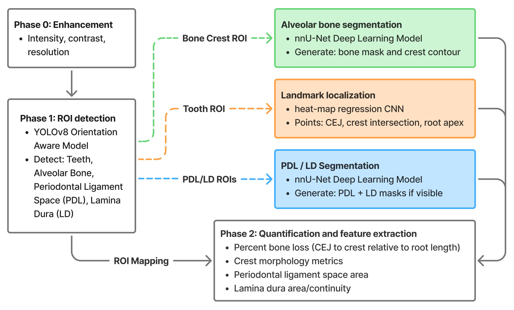

# Periapical Radiograph Analysis

This repository implements a multi-stage, automated pipeline for quantitative analysis of periapical radiographs, integrating image enhancement, region-of-interest detection, and downstream morphometric measurements. The framework leverages deep learning–based object detection and segmentation to extract clinically relevant landmarks and tissue metrics, enabling standardized, reproducible assessment of periodontal structures across heterogeneous periapical imaging conditions.

## Overview

This repository contains the codebase for the periapical radiograph analysis pipeline. The pipeline is designed to automatiacally identify ROIs of interest in periapical radiographs and quantitatively analyze them. The pipeline consists of three main components:

1. **Phase 0: Enhancement**. This phase applies image enhancement operations to improve radiographic quality and standardize inputs for downstream analysis. Current preprocessing includes global histogram equalization and adaptive histogram equalization to improve contrast across heterogeneous exposure conditions. A manual enhancement step is under consideration to allow user guided adjustment of contrast and intensity, followed by a denoising step to suppress acquisition and sensor noise while preserving anatomical boundaries. Additionally, parameters derived from user driven manual enhancement may be used to train a machine learning based enhancement model, enabling automated and reproducible image optimization in future analyses.

2. **Phase 1: ROI Detection**. This phase utilizes `YOLOv8 OBB` to detect and localize ROIs of interest in periapical radiographs. In specific, the pipeline is designed to identify `teeth`, `alveolar bone`, `periodontal ligament space`, and `lamina dura` (if present). These ROIs will be used to quantitatively analyze the periapical radiographs in a region specific manner which should improve the overall accuracy of the analysis.
    * **Alveolar Bone Crest ROI**: The alveolar bone crest ROI is defined as the region of the alveolar bone that is closest to the tooth. I will be using a `nnU-Net model` to segment the alveolar bone crest to quantify the curvature of the alveolar bone crest. I will also use this ROI to identify landmarks indicating the position of where the bone crest meets the tooth. The training data includes bone lines that are directly mapped form the original image. I will need to write a conversion script that maps the predefined bone lines to the ROIs for the training data.
    * **Tooth ROI**: The tooth ROI will be used to determine the CEJ landmarks as well as the apex points of the tooth. Again, the training data for the landmarks are available, however, they will need to be remapped based on a per-tooth basis.
    * **Periodontal Ligament Space ROI**: The periodontal ligament space ROI will be piped into a `nnU-Net model` to segment the periodontal ligament space to quantify the thickness of the periodontal ligament space.
    * **Lamina Dura ROI**: The lamina dura ROI will be piped into a `nnU-Net model` to segment the lamina dura to quantify the thickness of the lamina dura. Since this region is typically more difficult to identify, I may want to use a binary result to simply identify the presence of the lamina dura.

3. **Phase 2: Quantitative Analysis**. This phase will utilize the segmented ROIs to quantitatively analyze the periapical radiographs. Given the landmarks and segmentations, I should be able to calculate the following metrics:
    * Percent Bone Loss (PBL): The percent bone loss is defined as the percentage of bone loss relative to the total bone height. I will be using the calculating the CEJ to crest distance relative to the total tooth height to calculate the PBL.
    * Crest morphology metrics. This will include the smoothness of the crest.
    * Periodontal ligament space thickness.
    * Lamina dura thickness.
    * Alveolar bone density. I will most likely use the mean intensity of the alveolar bone ROI to calculate the alveolar bone density. There will need to be some sort of normalization step to account for the different acquisition conditions.

<br>


*Figure 1: Overview of the segmentation pipeline for identifying teeth and supporting structures.*

## Retrieving Data

The data used in this repository are publicly available from the following publication:

**Title:** *DenPAR: Annotated Intra-Oral Periapical Radiographs Dataset for Machine Learning*

**Journal:** *Nature Scientific Data*

**DOI / URL:** [https://www.nature.com/articles/s41597-025-05906-9](https://www.nature.com/articles/s41597-025-05906-9)

### Download and Directory Structure

1. Download the dataset associated with the publication above.
2. Extract the contents into a directory named **`Dataset`**.
3. Place the **`Dataset`** directory within the root of this repository.

The expected directory structure is:

```text
Periapical-Segmentation/
├── Dataset/
│   ├── (downloaded data files)
├── README.md
├── ROI Detection/
└── ...
```

All analysis scripts assume this directory structure. If the dataset is placed elsewhere, file paths must be updated accordingly.

## What needs to be done

* Adopt DentAnX for the new periapical radiograph analysis pipeline.
* Build scripts to read through the predefined ROI annotations and convert them to the format required for the training data.
* Build scripts to convert the CEJ landmarks to the appropriate format required for the training data.
* Build scripts to convert and map the bone lines to the specific ROIs for the training data.

## What has been done

* I am currenlty working on a conversion script that will read through the predefined ROI annotations and convert them to the format required for the training data. The script will read through the bone lines as well as the landmarks and convert them to DentAnX format.
* I modified the DentAnX codebase to allow for bone line annotations and landmarks to be added to the image canvas. I removed the anotations for the maxillary and mandibular ROIs since the periapical radiographs only contain either maxillary or mandibular teeth.
